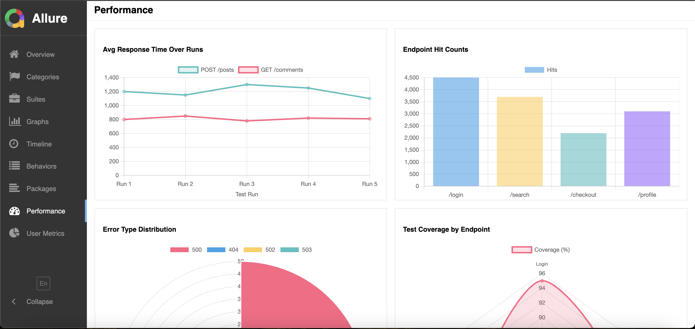
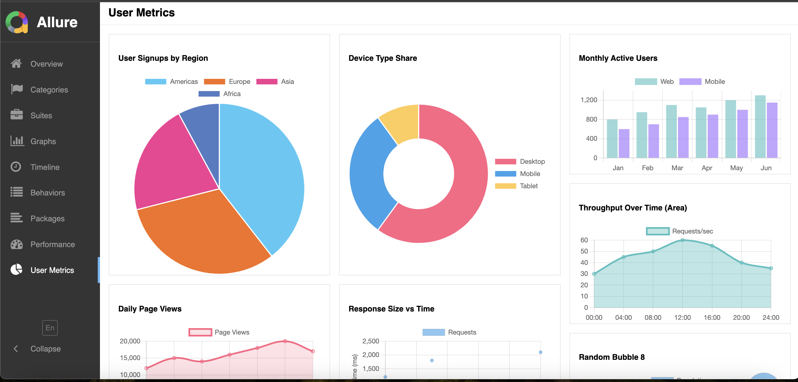

# Allure Graph Plugin




## Overview

The Allure Graph Plugin enriches your Allure reports by adding fully-configurable graph **pages** (tabs). You supply a single `graph-tabs.json` in your `allure-results/` folder; the plugin reads its `pages` array and renders one tab per page, each with its own icon, grid layout, and set of charts.

Under the hood we use [Chart.js](https://www.chartjs.org/) for **all** chart rendering, so your JSON must follow the Chart.js `type` + `data` + optional `options` structure exactly.

---

## Installation

1. **Build the plugin**

   ```bash
   mvn clean package
   ```

   This produces `target/allure-graphs-plugin.zip`.

2. **Install into Allure**
   This step depends on how Allure is installed on your system. Locate your Allure distribution directory and unzip the plugin into its `plugins/` folder. For example, if Allure is installed with `Homebrew` on mac, you would run this command for the default setup:

   ```bash
   unzip target/allure-graphs-plugin.zip -d /usr/local/opt/allure/libexec/plugins/allure-graphs-plugin/
   ```

   If you installed Allure via another package manager or have a custom path, adjust the destination directory so the plugin folder lives under `[ALLURE_HOME]/plugins/allure-graphs-plugin/`.

3. **Enable the plugin**
   After unzipping into the `plugins/` folder you must enable the plugin by adding it to your Allure configuration file. In `[ALLURE_HOME]/config/allure.yml`, include:

   ```yaml
   plugins:
     - other-plugins
     - allure-graphs-plugin
   ```

   If you use some other custom profile, enable the plugin in that config.

4. **Add your JSON config**
   Before the report generation (during or after the tests are finished) write a JSON file in the allure results folder:

   ```bash
   allure-results/graph-tabs.json
   ```

   The plugin will discover this file and build each tab defined under its `pages` array.

5. **Generate the report** **Generate the report**

   ```bash
   allure serve allure-results
   ```

---

## Configuration

### File naming

In your result generation logic you have to generate `graph-tabs.json` file in the `allure-results` folder. And when you run report generation command the reporter will pick up the file.

### JSON top-level schema

```json
{
  "pages": [
    {
      "key": "performance",
      "pageTitle": "Performance",
      "iconClass": "fa-tachometer",
      "columns": 2,
      "charts": [
        /* array of chart objects */
      ]
    },
    {
      "key": "usage",
      "pageTitle": "User Metrics",
      "iconClass": "fa-pie-chart",
      "columns": 3,
      "charts": [
        /* … */
      ]
    }
  ]
}
```

- **`pages`**: array of page definitions
- **`key`**: unique identifier; used as tab route and fallback title (if pageTitle is not set)
- **`pageTitle`**: name of the page (tab)
- **`iconClass`**: Font-Awesome v4 icon (no prefix)
- **`columns`**: integer ≥1; charts per row (default: 3)
- **`charts`**: array of chart specs; unknown types show a placeholder

---

## Chart object

Each chart is rendered by Chart.js. Your JSON must supply:

```json
{
  "chartType": "bar", // any Chart.js type: "pie","bar","line","radar","doughnut","polarArea","bubble","scatter",…
  "title": "My Chart",
  "data": {
    /* full Chart.js `data` object: */
    "labels": [
      /* labels array (optional for scatter/bubble) */
    ],
    "datasets": [
      {
        /* at minimum: */
        "data": [
          /* numeric array or [{x,y},{x,y,r}] for scatter/bubble */
        ]
        /* optional Chart.js dataset props: backgroundColor, borderColor, label, fill, etc. */
      }
    ]
  },
  "options": {
    /* optional Chart.js options override */
  }
}
```

Feel free to visit [Chart.js](https://www.chartjs.org/docs/latest/configuration/) documentation and go throught what each chart needs.

---

## Supported Chart Types

You may specify any Chart.js supported `type` — the plugin will forward your JSON straight to Chart.js. Common examples:

- `pie`, `doughnut`, `polarArea`
- `bar`, `horizontalBar`
- `line`, `area` (line with `fill: true`)
- `radar`
- `scatter`, `bubble`
- ... and more

---

## Full example

If you have correctly added the plugin, you can copy the JSON file into your `allure-result` folder as `graph-tabs.json` and generate a report. The example should create:

1. 2 pages (tabs) in the report, one is called "Performance", second is called "User Metrics"
2. in one tab there should be a `line` chart and a `bar` chart with various settings set
3. in the other tab there should be `pie` chart and a `scatter`chart

```json
{
  "pages": [
    {
      "key": "performance",
      "pageTitle": "Performance",
      "iconClass": "fa-tachometer",
      "columns": 2,
      "charts": [
        {
          "chartType": "line",
          "title": "Response Over Time",
          "data": {
            "labels": ["Run 1", "Run 2", "Run 3"],
            "datasets": [
              {
                "label": "GET /api",
                "data": [120, 110, 130],
                "borderColor": "#36A2EB",
                "backgroundColor": "rgba(54,162,235,0.2)",
                "fill": false
              }
            ]
          },
          "options": {
            "plugins": {
              "legend": {
                "position": "right"
              }
            }
          }
        },
        {
          "chartType": "bar",
          "title": "Error Rates",
          "data": {
            "labels": ["500", "404", "timeout"],
            "datasets": [
              {
                "label": "hits",
                "data": [5, 10, 2],
                "backgroundColor": "#FF6384"
              }
            ]
          },
          "options": {
            "scales": {
              "y": {
                "beginAtZero": true
              },
              "x": {
                "title": {
                  "display": true,
                  "text": "Status Code"
                }
              }
            },
            "plugins": {
              "legend": {
                "position": "bottom"
              }
            }
          }
        }
      ]
    },
    {
      "key": "usage",
      "pageTitle": "User Metrics",
      "iconClass": "fa-pie-chart",
      "columns": 3,
      "charts": [
        {
          "chartType": "pie",
          "title": "Device Distribution",
          "data": {
            "labels": ["Desktop", "Mobile", "Tablet"],
            "datasets": [
              {
                "data": [60, 30, 10],
                "backgroundColor": ["#4DC9F6", "#F67019", "#F53794"]
              }
            ]
          }
        },
        {
          "chartType": "scatter",
          "title": "Latency vs Throughput",
          "data": {
            "datasets": [
              {
                "label": "Sessions",
                "data": [
                  {
                    "x": 100,
                    "y": 200
                  },
                  {
                    "x": 200,
                    "y": 150
                  },
                  {
                    "x": 300,
                    "y": 250
                  }
                ],
                "backgroundColor": "rgba(153,102,255,0.6)"
              }
            ]
          },
          "options": {
            "scales": {
              "x": {
                "title": {
                  "display": true,
                  "text": "Throughput"
                }
              },
              "y": {
                "title": {
                  "display": true,
                  "text": "Latency (ms)"
                }
              }
            }
          }
        }
      ]
    }
  ]
}
```

### Other examples

In the `examples` folder you can find 2 JSONs with examples. Only one of them can be used at a time (you can merge the files into one if you want to). **Be sure to rename the file to `graph-tabs.json` when you put it into the results folder or it won't work**

---

## Limitations & Notes

- **No dynamic JS callbacks:** charts are purely JSON driven, custom interactivity (click handlers, tooltips beyond Chart.js defaults) must be implemented in a fork or extension.
- **Chart.js version:** the plugin loads Chart.js from CDN (latest), so features correspond to that release.
- **CSS & layout:** charts are placed in Allure’s standard widget grid; you can override via custom CSS if desired.

---

## Contribution

Contributions welcome! Feel free to:

- New chart-type support or improved placeholders
- Better error handling or schema validation
- CSS/layout tweaks for responsive design
- Additional examples or docs
- Unit tests for the Java part

Please fork, adhere to existing style and be sure to add docs with your PR.
